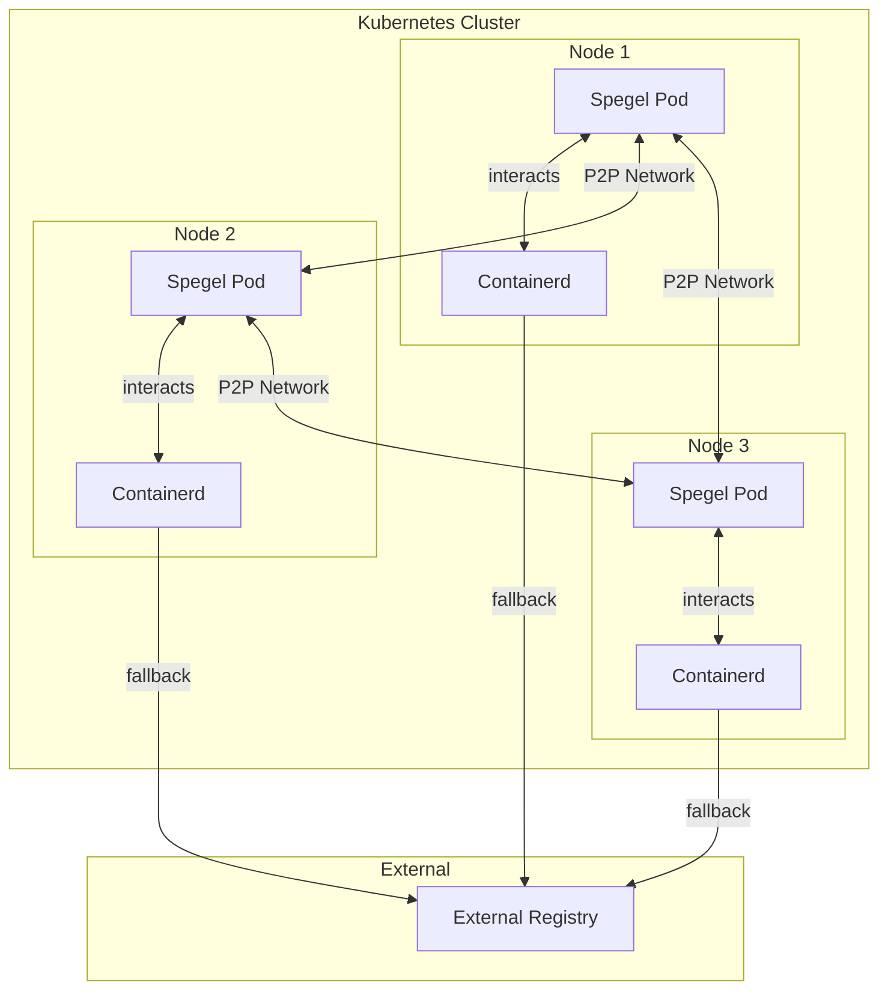
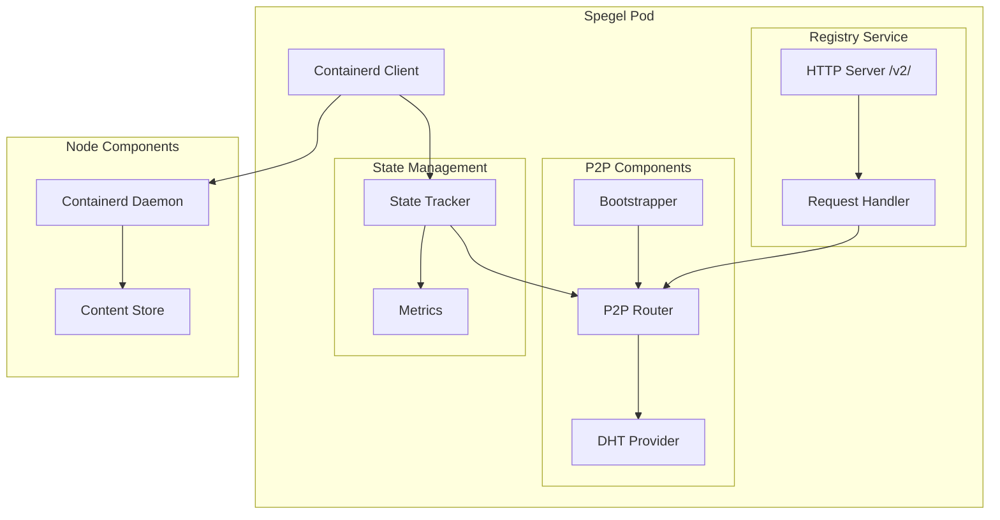
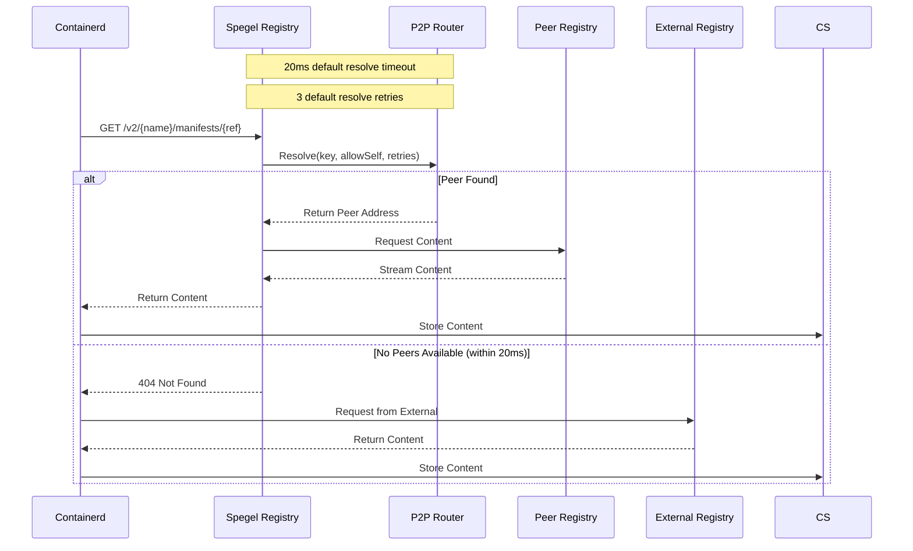
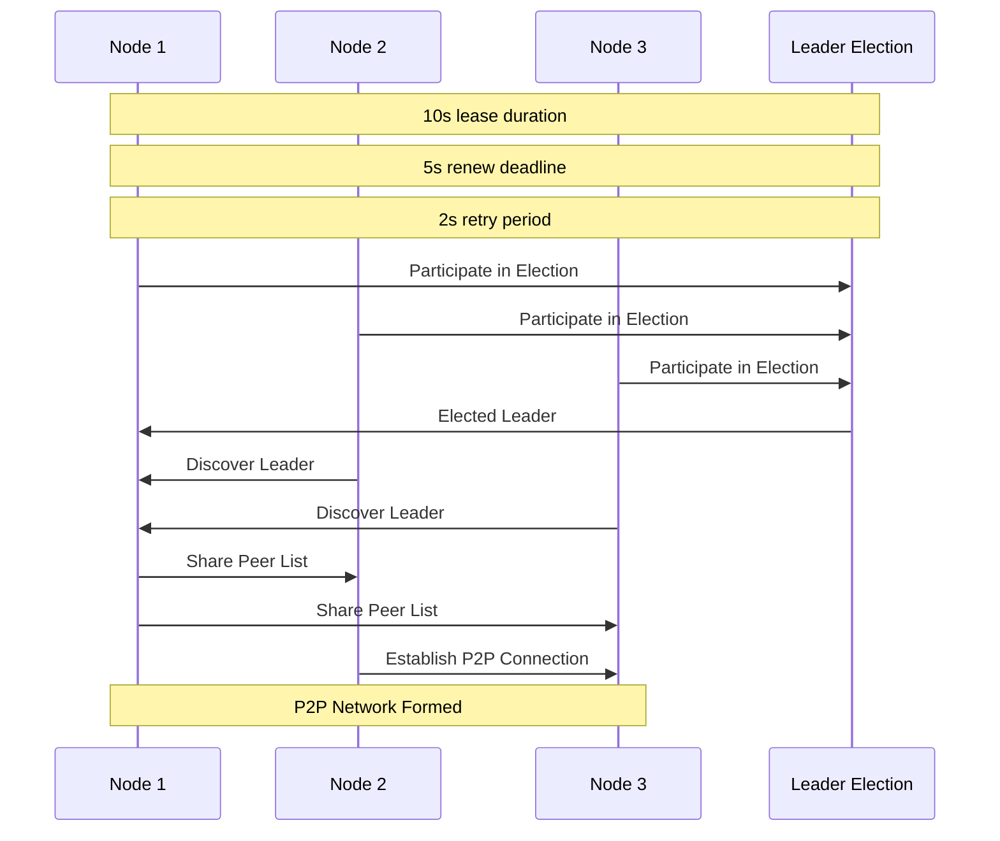
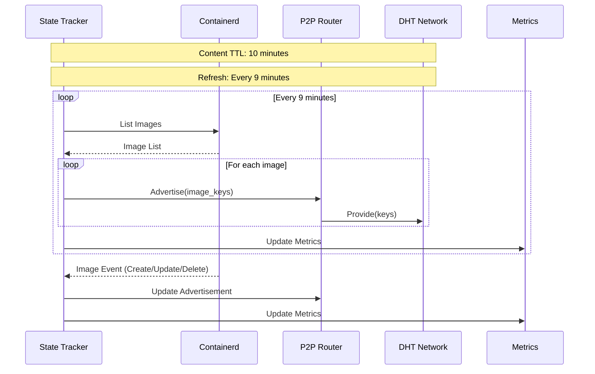
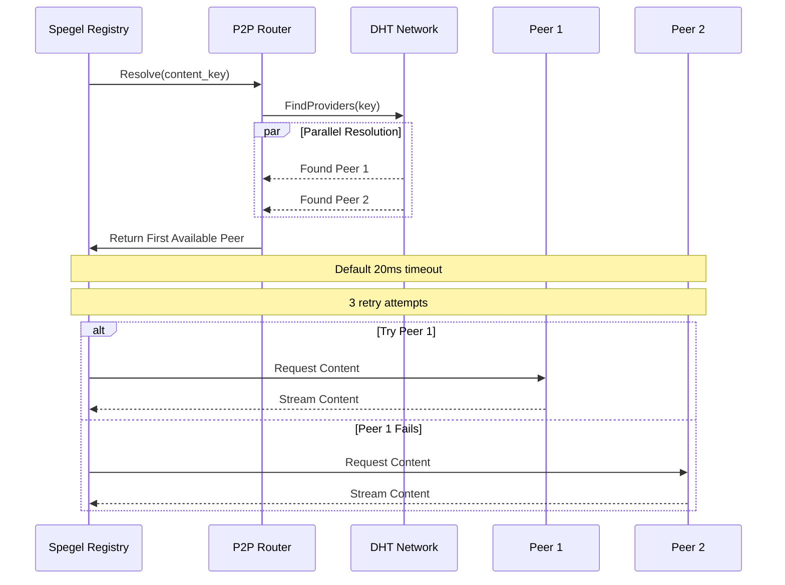
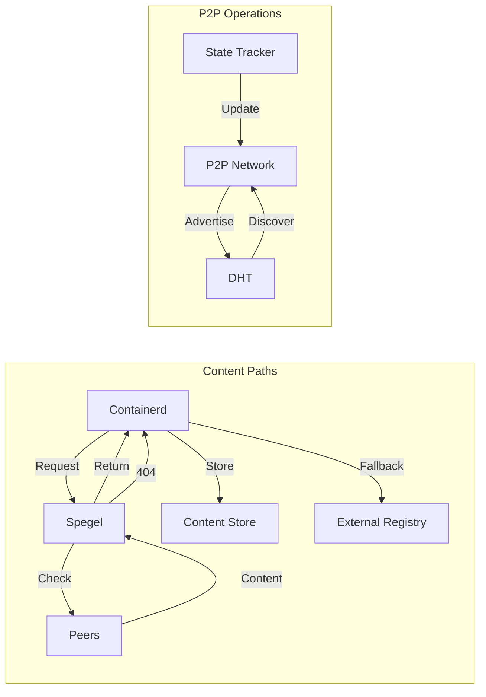
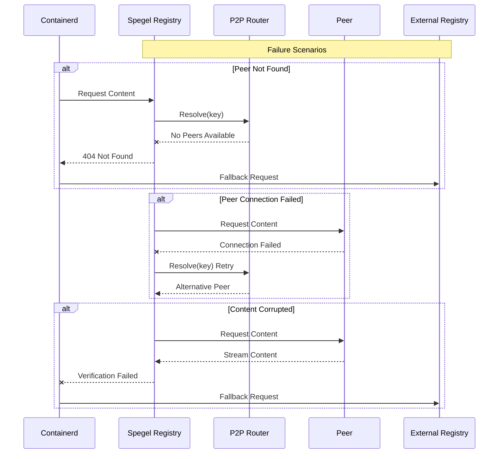
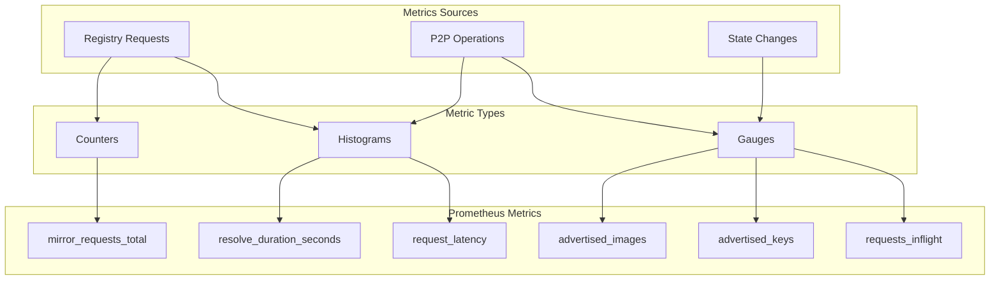

[Spegel](https://github.com/spegel-org/spegel) describes itself as a stateless, cluster-local OCI registry mirror. In this post, we’ll decipher what that means and explore why Spegel might be valuable for your Kubernetes (K8s) setup.

## What is Spegel?

1. **Stateless**: Spegel doesn’t store image manifests or layers itself; it relies on containerd’s store on the node.
2. **Local**: It operates within your local K8s cluster.
3. **OCI Registry**: It’s compliant with the OCI distribution specification.
4. **Mirror**: It mirrors images from a remote registry to your local cluster. (_Fun fact: "Spegel" means mirror in Swedish._)

## Why Use Spegel?

1. **Reduce Bandwidth Usage** to remote registries.
2. **Faster Image Pulls** if images are cached within the K8s cluster.
3. **Fault Tolerance** if the remote registry is unavailable.

## How Spegel Works

This blog focuses on visual diagrams that illustrate Spegel's inner workings, making it easier to map component connections and debug issues.

### Spegel Overview

Nodes in the cluster that need an image will first check if it’s available locally.

- If **available**, they pull it directly from other nodes using the P2P network.
- If **not available**, the system falls back to the remote registry.

## Spegel: Visual Architecture Guide

Let’s dive into Spegel’s architecture through a series of diagrams:

### 1. High-Level Cluster Architecture

This diagram shows how Spegel pods form a P2P network within the cluster. Each Spegel pod interacts with containerd and, if necessary, falls back to the external registry.

### 2. Pod Component Architecture

Displays the components within a Spegel pod, including registry services, P2P components, and state management.

### 3. Image Pull Flow

This sequence shows how an image pull request is handled, covering both peer pulls and fallback to external registry.

### 4. P2P Network Formation

Illustrates how nodes discover each other and form the P2P network through leader election and peer sharing.

### 5. State Management and Content Advertisement

Depicts how content availability is maintained and advertised across the P2P network.

### 6. Content Resolution Process

Shows content location and retrieval, including peer selection and retry mechanisms.

### 7. Data Flow Paths

Describes content and control flow within the system, including peer transfers and fallback.

### 8. Failure Handling

Demonstrates failure handling scenarios within the system.

### 9. Metrics Collection

Shows how metrics are collected and organized across the system components.

